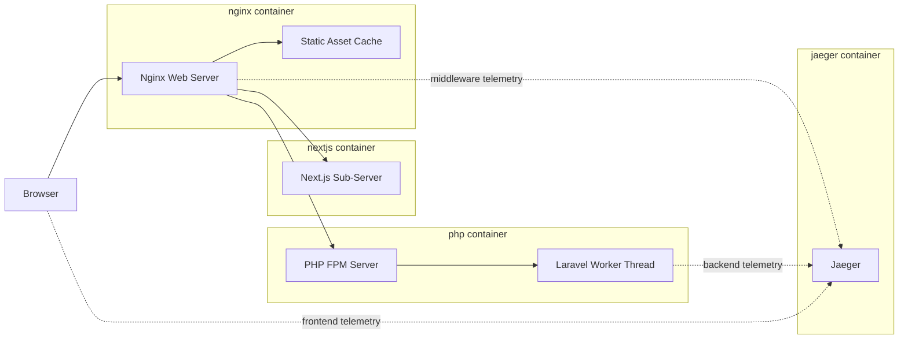

# Laravel + Next.js Sample App

This app is an academic example of a next.js frontend and a laravel backend for me to tinker with packages, frameworks, and the like in lean space.

The following Architecture diagram needs a Mermaid.js plugin to be viewed:


# Running the apps

## Prereqs

 - You need `docker engine` running on your computer. `docker` and `docker-compose` should both be on the path. 
 - if you plan on running the test javascript scripts you need `node` installed. i'm on `16.13.0`
 - if you plan on running the frontend outside of the docker environment you need `node` installed. i'm on `16.13.0`
 - if you plan on running the backend outside of the docker environment you need `PHP 8.1.10` installed with `fileinfo`, `curl`, `openssl`, `pdo_sqlite`, and `sockets` extensions enabled. You also need `composer` for installing dependencies
 - if you plan on hitting the backend directly for testing i recommend `postman`. I've included a few calls in the root of the project that postman can import.

## Launching with Docker

From the project root run `docker-compose up -d --build site`. when it completes all of its tasks you should be able to view the frontend at `localhost` in your browser, the backend should be directly available at `localhost:8000`, and the Jaeger UI should be available at `localhost:16686`. When you wish to tear down the environment use `docker-compose down`.
If you get database errors make sure that your `.\backend\.env` file has line 13 commented out and line 14 commented in.

## Launching the backend manually

From `.\backend\` you can install dependencies with `composer install` and then run the app with `php artisan serve`. note that you need to comment out line 14 of the `.\backend\.env` file and comment in line 13 (changing the path on line 13 to match your development environment)

## Launching the frontend manually

From `.\frontend\` you can install dependencies with `npm install` and then run the app with `npm run dev`

## Running Jaeger outside of docker is not supported at this time

I didn't want to install all of python on my desktop, I may try it later. you can run Jaeger by itself in docker via `docker run -d --name jaeger -p 6831:6831/udp -p 6832:6832/udp -p 16686:16686 jaegertracing/all-in-one:latest`

# Jaeger Notes

Jaeger's documentation can be found [here](https://www.jaegertracing.io/docs/1.38/). 

## General Use

Apps send data about their operation to Jaeger and Jaeger in turn makes that data useful to find things like outages or slowdowns. Jaeger keeps track of 'spans' of time taken by operations and correlates related operations together by relating spans into a hierarchy. This is done between apps by passing around some `span-id`s. In two apps linked by HTTP(S) this is done via a `Uber-Trace-Id` header added to the request. While spans can be marshalled and managed manually the best implementations of APMs use the applications middleware to automatically create and handle most tracking.

## Implementing Jaeger

Tracking an App consists of two parts, a `tracer` that makes, measures, and organizes `spans`; and an `exporter` which handles sending that data to Jaeger. Implementing tracing in an app requires code for both of these parts, and ideally some way of plugging into app middleware that can automate tracing.  

Jaeger has deprecated all of its client implementation libraries in favor of switching to the `OpenTelemetry Protocol (OTLP)`. OpenTelemetry docs can be found [here](https://opentelemetry.io/docs/reference/specification/protocol/). `OpenTracing` (predecessor to OTPL) also seems to work. Jaeger can also be connected to via plugins meant for other APMs such as an Zipkin libraries although this limits what data comes through and thus what features are available.

## Current state

Nginx and Laravel are both using `OpenTracing` to communicate with Jaeger. I found an `OpenTelemetry` package for Laravel but I haven't got it to work yet. I havent been able to find good support for `OpenTracing` in a Next.js or React library yet and so i've been playing around with `OpenTelemetry` in node. I'm not sure why the front end is not correlating spans correctly with the rest of the stack but my mixing of these two frameworks could be the cause. I also do not yet grasp how you are supposed to automatically capture and wrap web traffic in Next.js yet.

# Backend endpoints

## Register

POST `localhost:8000/api/apiregister`
```
{
    "name": "Kevin",
    "email": "kevin@trytradeup.com",
    "password": "Qwerty123!"
}
```

## Login

POST `localhost:8000/api/apilogin`
```
{
    "name": "Kevin",
    "email": "kevin@trytradeup.com",
    "password": "Qwerty123!"
}
```
Returns a token

## Get some sample data

GET `localhost:8000/api/articles`

Needs a bearer token in the auth headers from login

## Manual debugging endpoints 

GET `localhost:8000/api/fiveHundred` returns a 500

GET `localhost:8000/api/fourOhFour` returns a 404

GET `localhost:8000/api/fourHundred` returns a 400

GET `localhost:8000/api/error` causes an uncaught error in the PHP code

GET `localhost:8000/api/headers` returns the headers that the request had on it

# Laravel Learnings

## Install Dependencies

`composer install`
or if the lockfile is being a problem `composer update`

## Create the Database

modify the `.env` file `DB_DATABASE` to point somewhere correct for your project.
run `php artisan migrate`

## Seed the Database

`php artisan db:seed`

## Run the server

`php artisan serve`

## Make a new model (with migration)

`php artisan make:model MODELNAME -m`

## Make a new Seeder

`php artisan make:seeder MODELNAMETableSeeder`

add the seeder to `./database/seeders/DatabaseSeeder.php`

## Make a new controller

`php artisan make:controller MODELNAMEController`

## Make a migration

something like `php artisan make:migration --table=users adds_api_token_to_users_table`
